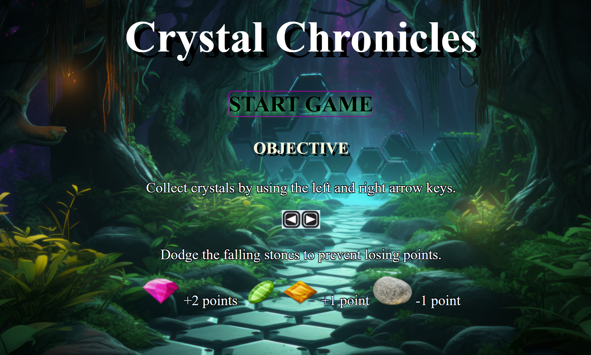
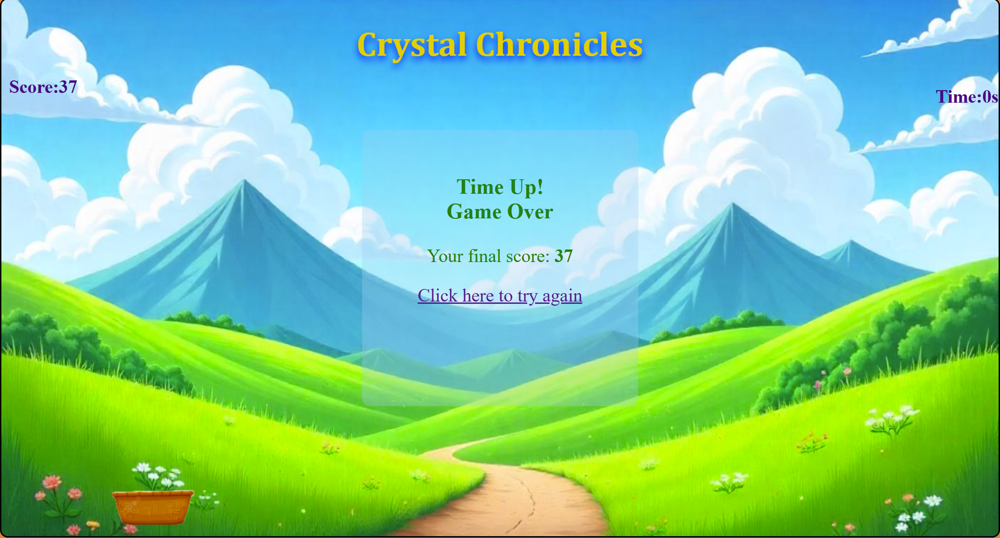

# Crystal Chronicles   💎🔶

## Summary
Crystal chronicles is an arcade game. The Player collects crystals avoiding stones in given time.

## Description
A simple game built using HTML, CSS and JAVASCRIPT. The game includes interactive elements and background music to enhance the player experience.  

## How to play the game 🎮
Use arrow keys to move left and right. Collect as many crystals as you can before time runs out to earn you points, while stones deduct your points. If your score reaches 0, you still have a chance. However, if it drops below 0, the game is over.

You can play the game by clicking this link:
(https://anjanahp.github.io/Crystal-Chronicles/)

## Future Improvements 
Add further levels    
Implement various obstacles

## Resources

https://developer.mozilla.org/en-US/docs/Web   
https://www.w3schools.com/css/default.asp   
Markdown format: https://www.markdownguide.org/basic-syntax   
Image : freepik.com and vecteezy.com   
Music : OpenGameArt
